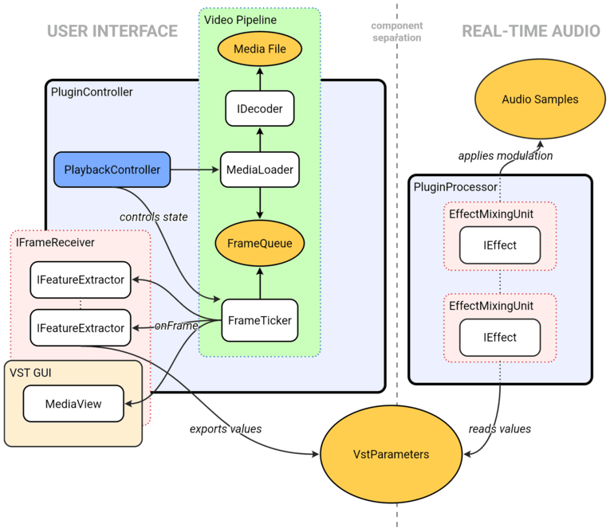

# Plugin architecture

This is an abridged description of the plugin's architecture. 
For an extensive 15+ page description with more diagrams, visit Chapter 4 of the Thesis.

## The essentials

*Visimusic* is a VST3 plugin. 

It follows the design pattern of VST SDK, separating it into two completely separated components.

- `PluginController` - services the GUI, manages states
- `PluginProcessor` - lives in the real-time context of audio processing

## High-level system relationships overview

*The entity relationships inside Visimusic.*

*Data types are shown in orange. Units with some amount of state control responsibility are shown in blue.*

*Notice the clear separation of the video processing in the user side and the audio processing in the real-time sensitive side of the plugin.*

## Video Pipeline

Inside the main controller, lives the video pipeline. It consists of two distinct parts.

- The **producer** side - `MediaLoader`, `IDecoder` - decode frames from a video file and create a frame flow
- Point of exchange - `FrameQueue` - a lock-free buffer that temporarily stores decoded frames
- The **consumer** side - `FrameTicker`, `IFeatureExtractor`, `MediaView` - frames are consumed only by the ticker at a steady rate, it distributes them further downstream for rendering in the GUI and visual calculations.

### FeatureExtractors

An independent unit that receives frames, calculates results in the form of normalized float values - VST parameters.

A FeatureExtractor exists for each part of the video that needs to be analyzed (e.g. brightness, motion, saturation).

The results of the extractors are transmitted to the processor through the means of VST parameters. This ensures the process never slows down audio processing.

### MediaView

The `MediaView`, responsible for rendering video is also a subscriber of frames at the same level as the extractors.
This makes the system completely independent on whether video is being shown or not.

## Audio processing

Real-time audio processing is done purely within the context of the `PluginProcessor`.

It contains an internal effect chain.
The processor receives changes made to the parameters, based on which it updates the settings of the connected effects.

### EffectMixingUnit

The effect chain consists of a number of `EffectMixingUnit`s. These contain an `IEffect` itself and also an assigned dry/wet amount of that specific effect.

During processing, each effect from the chain is applied at the specified intensity, sequentially.

### IEffect 

Each `IEffect` implementation precesses buffers of samples per-channel.

It contains a definition of signal processing that can be altered by a change of parameters.