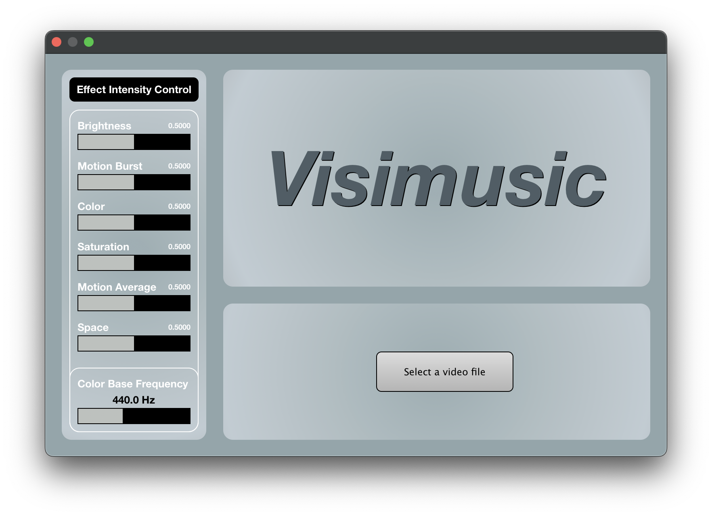
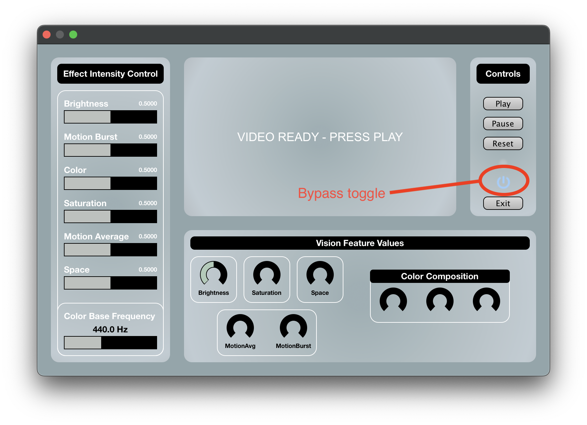
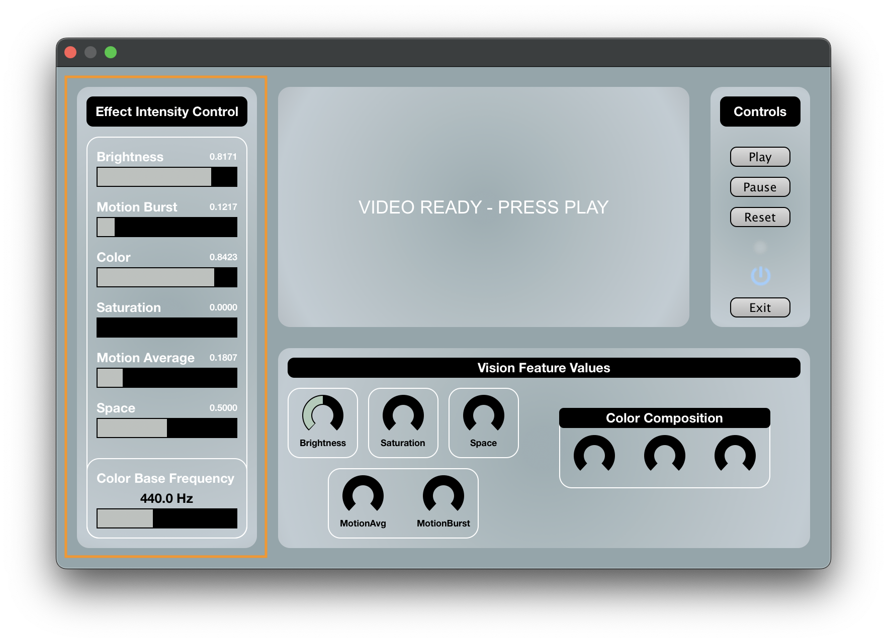
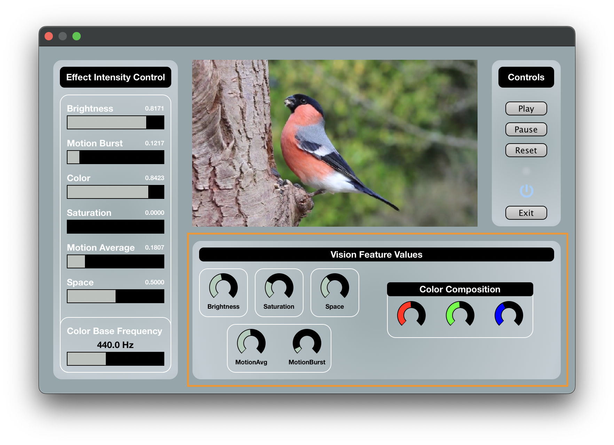
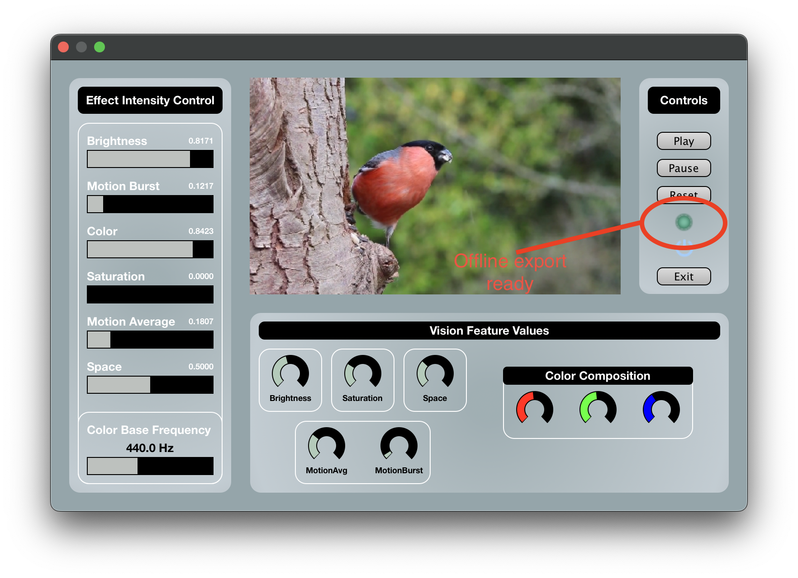

# User guide

Welcome to the user guide that will get you started with using the plugin with all of its features.

First, make sure that you have [installed the plugin](build_guide.md) and your DAW detects it.

## Input select view

Once you add the plugin to a track and open the interface, you will be prompted with the following layout

Click the *"Select a video file"* button. This will prompt you with a file explorer window (native to the operating system).
Only media formats supported by the plugin can be selected. 

Once you select a video of your liking the plugin will switch to a second layout.

## Video playback view

In this state, the video remains primed and ready to start with a click of the **Play** button.
See the part highlighted in red, this is the plugin's dedicated bypass button which toggles processing.

### Effect Intensity Control

The intensity of each effect can be controlled using the sliders located in the *Effect Intensity Control* section. 
*Intensity* represents the dry/wet mix of the specific effect. 
Using the intensity sliders is recommended for muting effects that cause unwanted results due to, e.g., a sonically incompatible input audio or a video without interesting changes to that specific effect's parameters.

The positions of the sliders reflect the flow of signal inside the plugin's inner effect chain. 
Specifically, starting from the top with *"Brightness"* and ending at the bottom, with the final effect applied being *"Space"*.

All parameters in this section can be automated \ref{automation}. A special case is the *"Color Base Frequency"* at the very bottom. This particular slider shifts the root from which the intervals in the color oscillators are calculated. Shifting the value across the frequency spectrum creates a special sweeping sound. 
Automating this parameter is encouraged as it can yield unique sounding results.

### Vision Feature Values

Once the video has started, the *"Vision Feature Values"* section begins changing in real time according to the video being played. 
Unlike the *"Effect Intensity Control"* panel, the values cannot be interacted with, as they only serve as displays.
The *"Color Composition"* section does not include labels to reduce visual cluttering. 
Instead, the actual colors of the indicators represent how much the color channel is currently present in the video.

### The effects - explained

- **Brightness** is represented by a low/high pass filter. Brightness value all the way down at zero is a fully low pass filter, inversely, at its peak it is a fully high pass filter. At midpoint, the signal is clean and without filtering.
- **Motion Burst** generates an airy and decaying noise element, imitating percussion as a result of sudden changes in the video. It is placed very early in the signal chain to allow further modulation by other effects.
- **Color** adds three oscillators tuned to three different intervals (They are the major third, perfect fifth and octave for red, green, blue respectively.) to the audio track. The individual oscillators are mixed in on the basis of the percentage of the color related to them. Use the *"Color Base Frequency"* slider to adjust the root frequency for the intervals of the oscillators.
- **Saturation** aims to make the sound brighter in relation to the intensity of colors inside a scene. Adds overdrive only to the highest frequencies.
- **Motion Average** applies a phaser with the speed of phasing determined by the amount of long-term motion.
- **Space** detects a large open scene (works best on landscapes) and tries to replicate the feeling of open-ness by adding delay/reverb to the mix.

### Automation

To allow full control at what times in the final track the selected video is being played, the plugin allows for automation of the *"Play"*, *"Pause"* , and *"Reset"* parameters. 
However, automating them comes with some guidelines.

The automation curves of the video control parameters should never overlap.
When creating a signal representing a button press, the curve should be of a rectangular shape, finally returning to zero signaling the end of the button press.
At other points in time, the parameter value should always be zero.

If the video has been paused or reset, the effect configuration persists in the last registered state. 
If this behavior is undesired, the *Bypass* parameter can be automated to completely skip the plugin's processing.

## Exporting
Exporting a project that uses *Visimusic* first requires automation to be configured.
Automation should state when the video starts in track time and optionally when it ends.
During export, the plugin always starts in the **Ready** state, and thus it waits for an automated *"Play"* parameter signal to start applying its processing. 
The control parameters change the plugin state during offline export in the exact same way as during the real-time preview, meaning redundant calls to parameters that do not move the state are silently ignored.

An important note is that offline export (faster than real-time) is only possible when the selected video has completed one full playback iteration.
This information is clearly signaled by a UI element in the *"Controls"* section. 
The ready state remains valid even in-between project re-opens.
The only time it gets invalidated is when the *"Exit"* button is pressed and the video is disengaged.

### Need more help?

Visit Chapter 2 of the Thesis for an even more in-depth user manual.